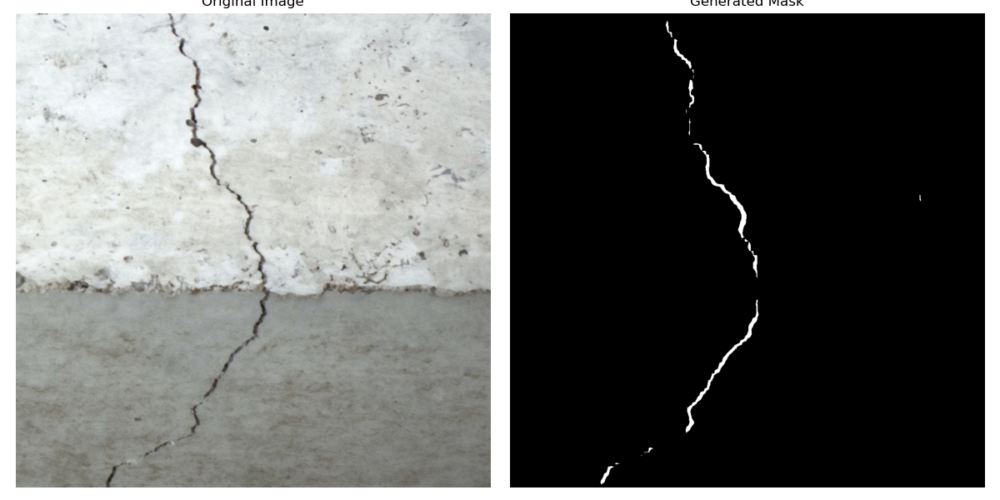

# DeepLabV3Resnet101 Crack Segmentation Project



## Overview

This repository hosts the Master's thesis project "CrackSense: A Pruned Neural Network Approach for Crack Detection on Embedded Devices." at the Bauhaus-university Weimar at the chair for Computer Vision.

The project emphasizes training DeepLabV3-Resnet101 models on the S2DS dataset for crack detection, with a unique focus on model pruning—both iteratively and in one shot—based on various mathematical importance criteria such as L1 Norm, L2 Norm, and Taylor Expansion. Additionally, the repository includes utilities for model inference, performance evaluation, and detailed class-wise metrics exportation to Excel, facilitating comprehensive analysis and application in embedded device environments.

## How to get started

Clone the repository and install the environment.

```
conda env create -f environment.yml
```

## Dataset structure

The dataset is expected to be structured in the following way:

```
├── test
│   ├── Images
│   │   ├── 678.png
│   │   ...
│   ├── Labels_grayscale
│   │   ├── 678.png
│   │   ...
│   └── Labels_RGB
│       ├── 678.png
│       ...
├── train
│   ├── Images
│   │   ├── 000.png
│   │   ...
│   ├── Labels_grayscale
│   │   ├── 000.png
│   │   ...
│   └── Labels_RGB
│       ├── 000.png
│       ...
└── val
    ├── Images
    │   ├── 563.png
    │   ...
    ├── Labels_grayscale
    │   ├── 563.png
    │   ...
    └── Labels_RGB
        ├── 563.png
        ...
```

## How to use

To train your model using the train.py script, you'll need to provide the directories for your training and validation datasets, along with a name for the training run. You can also specify additional options such as using a pruned model, training the entire pruned model, keeping feature extraction layers frozen, or loading pretrained weights.

```
python train.py path/to/train_dataset path/to/val_dataset training_run_name \
  --pruned_model path/to/pruned_model.pth \
  --train_pruned_fully True|False \
  --keep_feature_extract True|False \
  --load_pretrained_weights path/to/pretrained_weights.pth
```
To evaluate the model's performance on a test dataset, you can use the test.py script which saves the results into an excel sheet.

```
python test.py path/to/test_dataset \
  --weights path/to/model_weights.pth \
  --pruned_model path/to/pruned_model.pth \
  --use_pruned
```

The pruning script allows you to selectively prune the neural network model based on specific criteria to potentially enhance efficiency without significantly sacrificing accuracy.

```
python torchvision_pruning.py \
  --pruning_ratio 0-99 \
  --importance_type Taylor|Magnitude \
  --p_value INTEGER \
  --model_name YOUR_MODEL_NAME \
  --iterative_steps INTEGER \
  --state_dict path/to/your/model_state_dict.pth \
  --keep_feature_extract True|False
```

To run inference on an image, use the following command in your terminal, adjusting the arguments as needed:

```
python inference.py \
  --state_dict path/to/model_state_dict.pth \
  --image path/to/your/image.png \
  --mode side_by_side|overlay|save_mask \
  --save_figure
```

## Citation 

This project utilizes the S2DS dataset for crack detection, as introduced by Benz and Rodehorst. If you use this dataset in your research, please consider citing their work:

```
@inproceedings{benz2022image,
  title={Image-Based Detection of Structural Defects Using Hierarchical Multi-scale Attention},
  author={Benz, Christian and Rodehorst, Volker},
  booktitle={DAGM German Conference on Pattern Recognition},
  pages={337--353},
  year={2022},
  organization={Springer}
}
```
